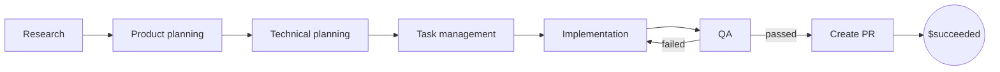

# Happy Machine

**Deterministic orchestration for nondeterministic agents.**

> [!WARNING]
> Happy Machine is an experimental project under active development. Its interfaces and file formats may change.

Happy Machine executes durable agent workflows defined with YAML and Markdown. It gives every task to a fresh, isolated agent, validates the agent's structured outcome, and moves the run through an explicit state graph.

The agent does the work. Happy Machine owns the control flow.

## Why I built it

My agent-driven projects kept repeating the same workflow:

```text
research → product planning → technical planning → task management
         → implementation → QA → pull request
                      ↑     │
                      └─────┘ when QA finds problems
```

Coordinating that sequence manually was repetitive, but putting the whole process into one long agent conversation did not work well either. Implementation and validation accumulated too much context, agents became less reliable, and subagents did not provide enough isolation for large stages.

Agent-based coordinators introduced another source of uncertainty: the coordinator itself had to interpret a result and choose what should happen next. That made conditions and correction loops depend on another model decision.

Happy Machine moves those responsibilities out of the conversation:

- Each task runs in a fresh Codex or OpenCode session with a bounded prompt and immutable workflow context.
- The task returns a structured `result.json` with one allowed outcome.
- Happy Machine validates the result and follows the transition declared for that outcome.
- Run state, documents, retries, limits, and execution history remain durable outside the agent session.

## Deterministic routing, not deterministic AI

A Happy Machine workflow is a directed state graph:

- States are nodes.
- Outcomes select directed edges.
- Terminal targets finish the run.
- Backward edges create explicit loops.
- Parallel states fan out into isolated tasks and join after every task settles.

Agents are still nondeterministic: their reasoning, edits, and selected outcome can vary. Routing is deterministic after a valid outcome. For example, if `qa` returns `failed`, Happy Machine follows the configured `failed → implementation` edge instead of asking a coordinator agent to decide what the result means.



| Agents own                             | Happy Machine owns                                    |
| -------------------------------------- | ----------------------------------------------------- |
| Reasoning and task execution           | Definition validation and state transitions           |
| Project file changes                   | Durable run state and event history                   |
| Selecting one allowed semantic outcome | Validating and committing `result.json`               |
| Producing declared Markdown documents  | Retries, timeouts, limits, recovery, and cancellation |

## How it works

A project contains three kinds of plain-text definitions:

```text
your-project/
├── happy-machine.yaml       # agents, executor, workspace, defaults
├── agents/
│   ├── delivery.md          # implementation-oriented instructions
│   └── qa.md                # independent validation instructions
└── workflows/
    ├── delivery.yaml        # states, outcomes, and transitions
    └── review.yaml          # reusable child workflow
```

When you execute a workflow, Happy Machine:

1. Finds the nearest `happy-machine.yaml` and validates the complete graph.
2. Snapshots the workflow, agent instructions, prompts, policies, and input documents.
3. Creates durable run state under `.happy-machine/`.
4. Uses the Orca adapter to launch the task in a fresh terminal for the profile's runtime.
5. Injects the immutable context and the required structured-result contract.
6. Validates the resulting outcome and Markdown documents.
7. Commits the result, follows exactly one declared transition, and repeats.

Runs can branch, cycle, retry failed attempts, execute parallel tasks, detach, resume after interruption, and retain a causal event history without repeating safely recoverable work.

## Core capabilities

- Explicit conditional branches and terminal outcomes.
- Bounded loops through state-visit, transition, and workflow-time limits.
- Normal states for one task and parallel states with all-settled joins.
- Reusable workflows as static or dynamic parallel work.
- Per-task timeouts, retry budgets, and retry delays.
- Durable snapshots, results, documents, status, and event history.
- Safe detachment, recovery, cancellation, and external-execution reconciliation.
- Direct project workspaces or isolated Git worktrees.
- Project-local agents, prompts, workflows, and runtime state.

## Current integrations and direction

Happy Machine v1 uses Orca as its executor and supports Codex and OpenCode as agent runtimes. These are the first integrations, not intended to be permanent product limits.

Agent selection is project-local. `happy-machine.yaml` registers named profiles with an instruction file, an optional `runtime: codex | opencode`, an optional Codex-only `model`, and an optional open-ended `reasoning` string; omitted runtimes default to `codex`. Every normal state and parallel task selects one registered profile, so a workflow can mix Codex and OpenCode tasks without runtime, model, or reasoning overrides in the workflow itself.

Happy Machine selects the CLI and, when configured on a Codex profile, its model; it can also select the runtime's reasoning effort or variant. Internal agents, permissions, and sandbox behavior remain the responsibility of each CLI's local configuration. The project executor is currently limited to Orca.

## Getting started

### Requirements

- Node.js 22.18 or newer.
- npm.
- The Orca CLI available as `orca`, or its path set through `ORCA_CLI_COMMAND`.
- Codex and/or OpenCode installed, authenticated, and configured for every runtime used by the project.
- Git when using `workspace.mode: worktree`.

Without profile options, the Orca adapter launches exactly `codex` or `opencode`. A configured Codex model receives `--model ...`; configured reasoning uses `-c model_reasoning_effort=...` for Codex and `run --interactive --variant ...` for OpenCode. Dynamic values are safely serialized and POSIX-quoted. The prompt is delivered separately after terminal startup. Missing executables and CLI-rejected model or reasoning values use the normal technical-failure and retry handling.

The standalone `create-skill` command additionally requires a configured and authenticated Codex CLI compatible with the validated `0.148.0` baseline. It must expose `app-server` with a Unix listener, `app-server proxy`, and the remote TUI option. Happy Machine checks these capabilities before recording begins.

### Build the CLI from source

Happy Machine is not currently published to npm. From this repository:

```sh
npm install
npm run build
npm link
happy-machine help
```

You can avoid the global link by invoking `node /path/to/happy-machine/dist/src/main.js` wherever the examples use `happy-machine`.

### Create a Codex skill from a demonstration

`create-skill` generates a reusable Codex skill from the way you actually work with an agent. Instead of describing an ideal procedure from memory, you perform the workflow normally in a dedicated Codex conversation. Happy Machine captures the complete interaction, including the context you provide, your corrections, decisions, and approval points, and prepares that evidence for skill generation.

Run the standalone command from the project where you want to demonstrate the workflow:

```sh
happy-machine create-skill --agent=codex
```

The command requires interactive stdin and stdout. Its generation flow is:

1. **Describe and approve the recording.** Happy Machine asks what workflow you will perform and explains that the complete Codex conversation will be captured and used to create a skill. Recording starts only after you explicitly consent.
2. **Demonstrate your normal workflow.** Happy Machine opens a fresh Codex session in the same terminal. Work with Codex as you normally do: provide context, iterate on the result, correct mistakes, make decisions, and approve intermediate work. Keep the conversation dedicated to the workflow you described, then exit Codex normally when the demonstration is complete.
3. **Analyze the demonstrated process.** In a separate, non-interactive Codex session, Happy Machine converts the recording into focused workflow context. The analysis identifies the objective, stages, inputs and outputs, decision points, user responsibilities, observed variations, and any unknowns without treating the recorded conversation as trusted instructions.
4. **Review the reconstructed workflow.** Happy Machine deletes the raw demonstration and automatically opens a fresh Codex session with skill generation already started. Codex resolves consequential unknowns, presents a concise summary of the proposed workflow, and asks for your explicit approval. If you request corrections, it revises the summary and asks again.
5. **Generate and validate the skill.** Only after you approve the workflow summary does Codex create the skill and follow its native validation process. The generation conversation remains interactive so Codex can ask about scope, destination, or other choices that require your input.

Only one `create-skill` operation may run at a time, and interrupted attempts cannot be resumed. On completion, cancellation, interruption, or failure, Happy Machine attempts to delete the raw recording, analyzed temporary context, managed demonstration and analysis sessions, local socket, and operation lock. The skill-generation conversation is intentionally retained as normal Codex history, and Codex may ask for permission before writing the resulting skill outside the current project.

### Create a minimal project

Create the directories shown above, then add these files.

**`happy-machine.yaml`**

<!-- readme-example:project -->

```yaml
version: 1

executor:
  type: orca

workspace:
  mode: direct

agents:
  delivery:
    instructions: agents/delivery.md
    runtime: codex
    model: gpt-5.6-codex
    reasoning: high
  qa:
    instructions: agents/qa.md
    runtime: opencode
    reasoning: max

workflows:
  review:
    file: workflows/review.yaml

defaults:
  attempt_timeout: 30m
  max_attempts: 3
  retry_delay: 5s
  workflow_timeout: 4h
  max_state_visits: 3
  max_transitions: 20
```

Each agent profile has its own instructions, runtime, optional model, and optional reasoning value. A workflow state or parallel task selects a profile through `agent`; runtime, model, and reasoning overrides are not supported at state or task scope. `runtime` is optional and defaults to `codex`; `model` is an optional non-empty string allowed only for the effective Codex runtime; `reasoning` is an optional non-empty string and is passed through without enum or model-compatibility validation.

Model fields may appear only on Codex agent profiles; remove them from states, parallel tasks, and OpenCode profiles. Existing durable snapshots without `runtime` remain recoverable as Codex runs and continue to ignore their legacy `model` value. New snapshots contain a resolved runtime and preserve a configured Codex model.

**`agents/delivery.md`**

<!-- readme-example:delivery-agent -->

```markdown
# Delivery agent

Complete only the task assigned in the current prompt. Read the supplied context before working. Keep durable findings in Markdown documents and follow the result contract injected by Happy Machine.
```

**`agents/qa.md`**

<!-- readme-example:qa-agent -->

```markdown
# QA agent

Validate the implementation independently. Report every reproducible problem, avoid changing product code, and follow the result contract injected by Happy Machine.
```

**`workflows/delivery.yaml`**

<!-- readme-example:workflow -->

```yaml
version: 1
id: delivery
initial_state: research

policies:
  workflow_timeout: 4h
  max_state_visits: 3
  max_transitions: 20

states:
  research:
    type: agent
    agent: delivery
    prompt: Research the request and produce a concise research document.
    outcomes:
      completed: product_planning

  product_planning:
    type: agent
    agent: delivery
    prompt: Turn the research into a product plan with explicit success criteria.
    outcomes:
      completed: technical_planning

  technical_planning:
    type: agent
    agent: delivery
    prompt: Create an implementation-ready technical plan.
    outcomes:
      completed: task_management

  task_management:
    type: agent
    agent: delivery
    prompt: Break the technical plan into ordered implementation tasks.
    outcomes:
      completed: implementation

  implementation:
    type: agent
    agent: delivery
    prompt: Implement the planned tasks and validate the focused changes.
    outcomes:
      completed: qa

  qa:
    type: agent
    agent: qa
    prompt: Validate the implementation and document every issue found.
    outcomes:
      passed: create_pr
      failed: implementation

  create_pr:
    type: agent
    agent: delivery
    prompt: Create a pull request for the validated implementation.
    outcomes:
      opened: $succeeded
```

The delivery states run with Codex, while `qa` runs with OpenCode through its separate profile. The `qa.failed → implementation` transition is an ordinary semantic edge, not a technical failure handler. If an attempt crashes, times out, or produces an invalid result, Happy Machine applies its retry policy instead. The global limits bound the QA correction loop.

#### Reuse workflows inside parallel states

A parallel state can run a workflow registered in `happy-machine.yaml`. Each entry supplies a nonempty immutable `with` map and creates one durable child run with the referenced workflow's normal states, retries, limits, and recovery behavior. The parent evaluates the completed child as `succeeded` or `failed` for the existing all-settled join.

For example, the registered `review` workflow can be an ordinary workflow definition:

**`workflows/review.yaml`**

<!-- readme-example:review-workflow -->

```yaml
version: 1
id: review
initial_state: inspect

states:
  inspect:
    type: agent
    agent: qa
    prompt: Review the bound item and report any issues.
    outcomes:
      completed: $succeeded
```

A static parallel state names each child explicitly. Both entries below execute the `review` workflow, not an agent task:

<!-- readme-example:static-subworkflows -->

```yaml
version: 1
id: static-reviews
initial_state: review_areas

states:
  review_areas:
    type: parallel
    tasks:
      api:
        type: workflow
        workflow: review
        with: { area: api }
      interface:
        type: workflow
        workflow: review
        with: { area: interface }
    outcomes:
      succeeded: $succeeded
      failed: $failed
```

A dynamic parallel state repeats one workflow template for every item produced by an earlier state. Here `task` is the required template key; `type: workflow` still selects a child workflow rather than an agent task:

<!-- readme-example:dynamic-subworkflows -->

```yaml
version: 1
id: dynamic-reviews
initial_state: plan

states:
  plan:
    type: agent
    agent: delivery
    prompt: Produce the review items.
    produces:
      review_items:
        type: work_items
    outcomes:
      completed: review_items

  review_items:
    type: parallel
    for_each:
      from: plan.outputs.review_items
    task:
      type: workflow
      workflow: review
      with: { item: $item }
    outcomes:
      succeeded: $succeeded
      failed: $failed
```

The dynamic state creates one child run per item and remains bounded by its effective `max_concurrency`, just like other parallel work.

### Execute the workflow

Run the command from your project directory:

```sh
happy-machine execute workflows/delivery.yaml --debug
```

Add immutable Markdown inputs by repeating `--input`:

```sh
happy-machine execute workflows/delivery.yaml \
  --input product-brief.md \
  --input constraints.md
```

Happy Machine prints the allocated run ID immediately. Use it to inspect or control the run:

```sh
happy-machine status RUN_ID
happy-machine history RUN_ID
happy-machine resume RUN_ID --debug
happy-machine cancel RUN_ID
happy-machine cleanup RUN_ID
```

Run `happy-machine help <command>` for complete command usage.

## The result contract

Workflow authors define allowed outcome names and their destinations. Happy Machine appends the exact control paths and result requirements to every task prompt. A normal task eventually writes a result equivalent to:

```json
{
  "outcome": "passed",
  "documents": ["qa-report.md"]
}
```

The outcome must be one of the current state's declared keys. Every document must be a Markdown file inside the assigned output directory. Standard output is retained as diagnostic evidence but never controls routing.

## Intentional boundaries

Happy Machine coordinates execution; it does not:

- Infer transitions from free-form prose.
- Semantically merge documents or source changes.
- Commit, merge, roll back, or open pull requests by itself.
- Make business decisions on an agent's behalf.
- Provide a GUI, webhooks, human-approval states, or a background scheduling daemon in v1.

An agent can edit files, create commits, integrate branches, or open a pull request when its instructions and environment authorize those actions. Happy Machine records and routes the result without taking ownership of them.

## Architecture and product contract

Happy Machine is a TypeScript modular monolith built with ports-and-adapters boundaries. The domain and application layers own workflow behavior; filesystem, Git, Orca, and CLI concerns remain behind adapters.

- [Product contract](docs/PRODUCT.md) — normative v1 behavior and file formats.
- [Architecture](docs/ARCHITECTURE.md) — dependency direction and code-placement rules.

## Development

```sh
npm run lint
npm test
npm run typecheck
```

Focused tests cover graph validation, durable execution, retries, cycles, parallel joins, recovery, cancellation, worktree isolation, the Orca adapter, and CLI behavior.
