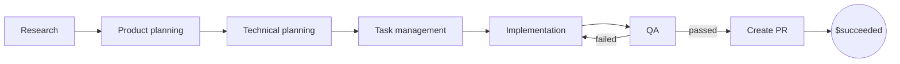

# Happy Machine

**Deterministic orchestration for nondeterministic agents.**

> [!WARNING]
> Happy Machine is an experimental project under active development. Its interfaces and file formats may change.

Happy Machine executes durable agent workflows defined with YAML and Markdown. It gives every task to a fresh, isolated agent, validates the agent's structured outcome, and moves the run through an explicit state graph.

The agent does the work. Happy Machine owns the control flow.

## Why I built it

My agent-driven projects kept repeating the same workflow:

```text
research → product planning → technical planning → task management
         → implementation → QA → pull request
                              ↑     │
                              └─────┘ when QA finds problems
```

Coordinating that sequence manually was repetitive, but putting the whole process into one long agent conversation did not work well either. Implementation and validation accumulated too much context, agents became less reliable, and subagents did not provide enough isolation for large stages.

Agent-based coordinators introduced another source of uncertainty: the coordinator itself had to interpret a result and choose what should happen next. That made conditions and correction loops depend on another model decision.

Happy Machine moves those responsibilities out of the conversation:

- Each task runs in a fresh Codex session with a bounded prompt and immutable workflow context.
- The task returns a structured `result.json` with one allowed outcome.
- Happy Machine validates the result and follows the transition declared for that outcome.
- Run state, documents, retries, limits, and execution history remain durable outside the agent session.

## Deterministic routing, not deterministic AI

A Happy Machine workflow is a directed state graph:

- States are nodes.
- Outcomes select directed edges.
- Terminal targets finish the run.
- Backward edges create explicit loops.
- Parallel states fan out into isolated tasks and join after every task settles.

Agents are still nondeterministic: their reasoning, edits, and selected outcome can vary. Routing is deterministic after a valid outcome. For example, if `qa` returns `failed`, Happy Machine follows the configured `failed → implementation` edge instead of asking a coordinator agent to decide what the result means.



| Agents own                             | Happy Machine owns                                    |
| -------------------------------------- | ----------------------------------------------------- |
| Reasoning and task execution           | Definition validation and state transitions           |
| Project file changes                   | Durable run state and event history                   |
| Selecting one allowed semantic outcome | Validating and committing `result.json`               |
| Producing declared Markdown documents  | Retries, timeouts, limits, recovery, and cancellation |

## How it works

A project contains three kinds of plain-text definitions:

```text
your-project/
├── happy-machine.yaml       # agents, executor, workspace, defaults
├── agents/
│   └── worker.md            # reusable agent instructions
└── workflows/
    └── delivery.yaml        # states, outcomes, and transitions
```

When you execute a workflow, Happy Machine:

1. Finds the nearest `happy-machine.yaml` and validates the complete graph.
2. Snapshots the workflow, agent instructions, prompts, policies, and input documents.
3. Creates durable run state under `.happy-machine/`.
4. Uses the current Orca adapter to launch the task in a fresh Codex terminal.
5. Injects the immutable context and the required structured-result contract.
6. Validates the resulting outcome and Markdown documents.
7. Commits the result, follows exactly one declared transition, and repeats.

Runs can branch, cycle, retry failed attempts, execute parallel tasks, detach, resume after interruption, and retain a causal event history without repeating safely recoverable work.

## Core capabilities

- Explicit conditional branches and terminal outcomes.
- Bounded loops through state-visit, transition, and workflow-time limits.
- Normal states for one task and parallel states with all-settled joins.
- Per-task timeouts, retry budgets, and retry delays.
- Durable snapshots, results, documents, status, and event history.
- Safe detachment, recovery, cancellation, and external-execution reconciliation.
- Direct project workspaces or isolated Git worktrees.
- Project-local agents, prompts, workflows, and runtime state.

## Current integrations and direction

Happy Machine v1 uses Orca as its executor and Codex as its agent runtime. They are the first integrations, not intended to be permanent product limits.

The planned configuration model will make the executor selectable per project. Each project-local agent will also select its runtime—such as Codex, Claude Code, or OpenCode—together with its model. That configurability is a future direction and is not implemented yet; the current closed schema accepts only Orca and the current adapter launches Codex.

## Getting started

### Requirements

- Node.js 22.18 or newer.
- npm.
- The Orca CLI available as `orca`, or its path set through `ORCA_CLI_COMMAND`.
- Codex installed and configured in the environment where Orca opens terminals.
- Git when using `workspace.mode: worktree`.

The current Orca adapter launches the plain `codex` command. Model, permission, and sandbox behavior therefore come from your local Codex configuration; Happy Machine does not override them on launch. Other executors and agent runtimes are planned, not currently supported.

### Build the CLI from source

Happy Machine is not currently published to npm. From this repository:

```sh
npm install
npm run build
npm link
happy-machine help
```

You can avoid the global link by invoking `node /path/to/happy-machine/dist/src/main.js` wherever the examples use `happy-machine`.

### Create a minimal project

Create the directories shown above, then add these files.

**`happy-machine.yaml`**

<!-- readme-example:project -->

```yaml
version: 1

executor:
  type: orca

workspace:
  mode: direct

agents:
  worker:
    instructions: agents/worker.md
    model: local-codex-model

defaults:
  attempt_timeout: 30m
  max_attempts: 3
  retry_delay: 5s
  workflow_timeout: 4h
  max_state_visits: 3
  max_transitions: 20
```

The `model` field is currently required by the project schema. The terminal-only Orca adapter still uses the model selected by your local Codex configuration. Per-agent runtime and model selection are planned for a later configuration contract.

**`agents/worker.md`**

<!-- readme-example:agent -->

```markdown
# Delivery workflow agent

Complete only the task assigned in the current prompt. Read the supplied context before working. Keep durable findings in Markdown documents and follow the result contract injected by Happy Machine.
```

**`workflows/delivery.yaml`**

<!-- readme-example:workflow -->

```yaml
version: 1
id: delivery
initial_state: research

policies:
  workflow_timeout: 4h
  max_state_visits: 3
  max_transitions: 20

states:
  research:
    type: agent
    agent: worker
    prompt: Research the request and produce a concise research document.
    outcomes:
      completed: product_planning

  product_planning:
    type: agent
    agent: worker
    prompt: Turn the research into a product plan with explicit success criteria.
    outcomes:
      completed: technical_planning

  technical_planning:
    type: agent
    agent: worker
    prompt: Create an implementation-ready technical plan.
    outcomes:
      completed: task_management

  task_management:
    type: agent
    agent: worker
    prompt: Break the technical plan into ordered implementation tasks.
    outcomes:
      completed: implementation

  implementation:
    type: agent
    agent: worker
    prompt: Implement the planned tasks and validate the focused changes.
    outcomes:
      completed: qa

  qa:
    type: agent
    agent: worker
    prompt: Validate the implementation and document every issue found.
    outcomes:
      passed: create_pr
      failed: implementation

  create_pr:
    type: agent
    agent: worker
    prompt: Create a pull request for the validated implementation.
    outcomes:
      opened: $succeeded
```

The `qa.failed → implementation` transition is an ordinary semantic edge, not a technical failure handler. If an attempt crashes, times out, or produces an invalid result, Happy Machine applies its retry policy instead. The global limits bound the QA correction loop.

### Execute the workflow

Run the command from your project directory:

```sh
happy-machine execute workflows/delivery.yaml --debug
```

Add immutable Markdown inputs by repeating `--input`:

```sh
happy-machine execute workflows/delivery.yaml \
  --input product-brief.md \
  --input constraints.md
```

Happy Machine prints the allocated run ID immediately. Use it to inspect or control the run:

```sh
happy-machine status RUN_ID
happy-machine history RUN_ID
happy-machine resume RUN_ID --debug
happy-machine cancel RUN_ID
happy-machine cleanup RUN_ID
```

Run `happy-machine help <command>` for complete command usage.

## The result contract

Workflow authors define allowed outcome names and their destinations. Happy Machine appends the exact control paths and result requirements to every task prompt. A normal task eventually writes a result equivalent to:

```json
{
  "outcome": "passed",
  "documents": ["qa-report.md"]
}
```

The outcome must be one of the current state's declared keys. Every document must be a Markdown file inside the assigned output directory. Standard output is retained as diagnostic evidence but never controls routing.

## Intentional boundaries

Happy Machine coordinates execution; it does not:

- Infer transitions from free-form prose.
- Semantically merge documents or source changes.
- Commit, merge, roll back, or open pull requests by itself.
- Make business decisions on an agent's behalf.
- Provide a GUI, webhooks, human-approval states, or a background scheduling daemon in v1.

An agent can edit files, create commits, integrate branches, or open a pull request when its instructions and environment authorize those actions. Happy Machine records and routes the result without taking ownership of them.

## Architecture and product contract

Happy Machine is a TypeScript modular monolith built with ports-and-adapters boundaries. The domain and application layers own workflow behavior; filesystem, Git, Orca, and CLI concerns remain behind adapters.

- [Product contract](docs/PRODUCT.md) — normative v1 behavior and file formats.
- [Architecture](docs/ARCHITECTURE.md) — dependency direction and code-placement rules.

## Development

```sh
npm run lint
npm test
npm run typecheck
```

Focused tests cover graph validation, durable execution, retries, cycles, parallel joins, recovery, cancellation, worktree isolation, the Orca adapter, and CLI behavior.
